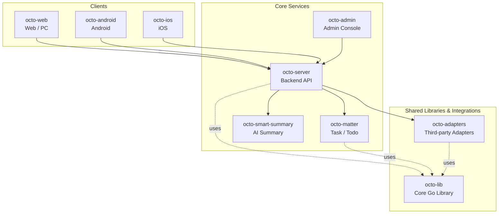

<p align="center">
  
  
</p>

<p align="center">
  <b>OCTO — the open workplace built for humans × AI agents.</b><br/>
  <sub>Let <b>Lobsters</b> (OpenClaw-powered digital doubles) do the <i>thinking</i> and <i>doing</i>. You focus on <i>taste</i>.</sub>
</p>

<p align="center">
  <a href="https://github.com/Mininglamp-OSS"><b>🏠 OCTO Home</b></a> ·
  <a href="#-quickstart"><b>🚀 Quickstart</b></a> ·
  <a href="#-octo-ecosystem"><b>📦 Ecosystem</b></a> ·
  <a href="./CONTRIBUTING.md"><b>🤝 Contributing</b></a>
</p>

<p align="center">
  <a href="./LICENSE"></a>
  <a href="./README.zh.md"></a>
</p>

---

> 🌐 **Read in**: **English** · [简体中文](README.zh.md)

# OCTO Server

> **The Go backend** at the centre of OCTO — REST + WebSocket APIs, Lobster agent orchestration, and the control plane for WuKongIM.

`octo-server` is the heart of the OCTO platform. It exposes REST +
WebSocket APIs consumed by
[`octo-web`](https://github.com/Mininglamp-OSS/octo-web) and
[`octo-admin`](https://github.com/Mininglamp-OSS/octo-admin), orchestrates
business logic and Lobster (AI agent) scheduling, and drives the
[`WuKongIM`](https://github.com/WuKongIM/WuKongIM) IM core for real-time
messaging.

## 🌟 Why OCTO Server

- **One anchor for the whole platform.** Clients, adapters, matter, summary, and admin all meet at `octo-server`. Deploy and scale one backend; everything else speaks to it.
- **Lobster-orchestration first class.** Routing, session, and tool-call execution for OpenClaw-powered digital doubles are built into the server, not bolted on. Agents are treated as first-class conversation participants.
- **Pluggable storage & IM.** MySQL-compatible SQL migrations and object-storage adapters ship in the box; WuKongIM is driven over a thin control-plane boundary so the IM core remains swappable.

## 🚀 Quickstart

```bash
git clone https://github.com/Mininglamp-OSS/octo-server.git
cd octo-server
go build ./...
./octo-server --config ./config/dev.yaml
```

The default dev config expects a local WuKongIM instance and a
MySQL-compatible database. See `config/dev.yaml.example` and the
`docker/` directory for a minimal local stack, plus [`QUICKSTART.md`](./QUICKSTART.md)
and [`BUILDING.md`](./BUILDING.md) for a full walkthrough.

## 📦 Modules / Architecture

High-level layout:

| Path | Purpose |
|---|---|
| `cmd/` | Service entry points (`octo-server`, subcommands) |
| `internal/api/` | REST + WebSocket handlers — conversation, user, group, file, org, webhook |
| `internal/service/` | Business logic — access control, Lobster orchestration, IM fan-out |
| `internal/repository/` | SQL + cache repositories (MySQL, Redis) |
| `internal/im/` | Control-plane client for WuKongIM (channel / message / presence) |
| `internal/agent/` | Lobster routing, session store, tool-call execution |
| `internal/adapter/` | Adapter registration + dispatch surfaces |
| `config/` | YAML config schema + dev / prod examples |
| `docker/` | Minimal compose stack (server + WuKongIM + MySQL + Redis) |
| `migrations/` | SQL schema migrations |
| `docs/` | Architecture notes, API reference, diagrams |

What the server does each request:

1. **Authenticate** — token / cookie / DH-sealed WebSocket frame.
2. **Authorise** — org-aware RBAC, per-channel ACL, agent-identity gating.
3. **Execute** — run business logic, possibly spawning / resuming a Lobster agent session.
4. **Fan out** — enqueue IM message via WuKongIM, trigger adapters if the channel requires an external bridge.
5. **Respond** — unified JSON envelope (or WebSocket frame) with tracing + metrics tags.

## 🔗 OCTO Ecosystem

<!-- shared snippet: OCTO repo matrix. Keep identical across all 9 repos. -->



| Repository | Language | Role |
|---|---|---|
| [`octo-server`](https://github.com/Mininglamp-OSS/octo-server) | Go | Backend API · business orchestration · Lobster agent scheduling |
| [`octo-matter`](https://github.com/Mininglamp-OSS/octo-matter) | Go | Task / Todo / Matter micro-service |
| [`octo-smart-summary`](https://github.com/Mininglamp-OSS/octo-smart-summary) | Go | LLM-powered conversation summarisation |
| [`octo-web`](https://github.com/Mininglamp-OSS/octo-web) | TypeScript / React | Web & PC (Electron) client |
| [`octo-android`](https://github.com/Mininglamp-OSS/octo-android) | Kotlin / Java | Native Android client |
| [`octo-ios`](https://github.com/Mininglamp-OSS/octo-ios) | Swift / Objective-C | Native iOS client |
| [`octo-admin`](https://github.com/Mininglamp-OSS/octo-admin) | TypeScript / React | Admin console (tenant / org / user / channel management) |
| [`octo-lib`](https://github.com/Mininglamp-OSS/octo-lib) | Go | Shared core library (protocol, crypto, storage, HTTP) |
| [`octo-adapters`](https://github.com/Mininglamp-OSS/octo-adapters) | TypeScript / Python | Third-party integrations (IM bridges, AI channels) |

## 🧭 Philosophy

OCTO ships under three shared principles that apply to every repository in this matrix:

1. **Local-first.** Anything that can run on the user's own box — chats, embeddings, agents — should. Your data stays yours; cloud is a choice, not a requirement.
2. **Humans judge, AI thinks and acts.** Humans focus on *taste* (what matters, what's right, what to ship). Lobster agents — OpenClaw-powered digital doubles — carry the *thinking* and *execution* load.
3. **Release-as-product.** Every open-source cut is shipped as a self-contained product, not a code dump: one squash per release, Apache 2.0, no internal baggage, reproducible from this repo alone.

## 🤝 Contributing

We love pull requests! Before you open one, please read:

- [CONTRIBUTING.md](CONTRIBUTING.md) — workflow, branch model, commit style
- [CODE_OF_CONDUCT.md](CODE_OF_CONDUCT.md) — community expectations

For security issues please follow [SECURITY.md](SECURITY.md) instead of the public tracker.

## 📄 License

Apache License 2.0 — see [LICENSE](LICENSE) for the full text and [NOTICE](NOTICE) for third-party attributions.

## 🙏 Acknowledgments

`octo-server` is a derivative work of:

- **[TangSengDaoDaoServer](https://github.com/TangSengDaoDao/TangSengDaoDaoServer)** — our upstream, by the TangSengDaoDao team.
- **[WuKongIM](https://github.com/WuKongIM/WuKongIM)** — the real-time messaging core we drive.

See [NOTICE](NOTICE) for the exhaustive Go module license inventory and third-party attribution block.

---

<p align="center">
  <sub>Made with 🐙 by <b>OCTO Contributors</b> · <a href="https://github.com/Mininglamp-OSS">Mininglamp-OSS</a></sub>
</p>
