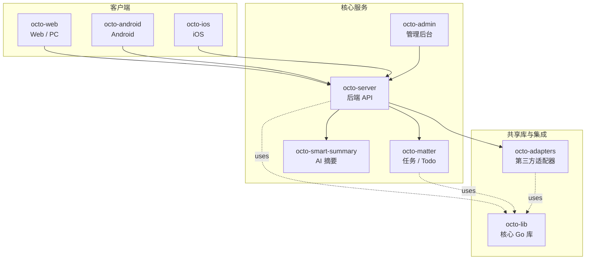

<p align="center">
  
  
</p>

<p align="center">
  <b>OCTO —— 为人和 AI Agent 协作而生的开源工作平台。</b><br/>
  <sub>让 <b>龙虾（Lobster / OpenClaw-powered digital double agents）</b>去「思」和「行」，让人专注于「品」。</sub>
</p>

<p align="center">
  <a href="https://github.com/Mininglamp-OSS"><b>🏠 OCTO 主页</b></a> ·
  <a href="#-快速开始"><b>🚀 快速开始</b></a> ·
  <a href="#-octo-生态"><b>📦 生态</b></a> ·
  <a href="./CONTRIBUTING.zh.md"><b>🤝 贡献</b></a>
</p>

<p align="center">
  <a href="./LICENSE"></a>
  <a href="./README.md"></a>
</p>

---

> 🌐 **语言**: [English](README.md) · **简体中文**

# OCTO Server（简体中文）

> **Go 后端** —— OCTO 平台的中心节点：REST + WebSocket API、龙虾 Agent 编排、WuKongIM 控制面。

`octo-server` 是 OCTO 平台的心脏。它向
[`octo-web`](https://github.com/Mininglamp-OSS/octo-web) 与
[`octo-admin`](https://github.com/Mininglamp-OSS/octo-admin)
提供 REST 与 WebSocket 接口，负责业务编排与龙虾（Lobster / AI Agent）调度，
并通过 [`WuKongIM`](https://github.com/WuKongIM/WuKongIM) 驱动实时消息底座。

## 🌟 为什么选 OCTO Server

- **整个平台只有一个锚点。** 客户端、adapter、matter、summary、admin 最终都汇聚到 `octo-server`。你只需部署与扩展一个后端，其它组件都走它。
- **龙虾编排是一等公民。** OpenClaw 驱动的数字分身的路由、会话、工具调用都原生内置，不是外挂。Agent 在会话里是一等参与者。
- **存储与 IM 均可替换。** 内置 MySQL 兼容的 SQL 迁移脚本与对象存储适配；WuKongIM 通过一个薄的控制面边界驱动，底座可替换。

## 🚀 快速开始

```bash
git clone https://github.com/Mininglamp-OSS/octo-server.git
cd octo-server
go build ./...
./octo-server --config ./config/dev.yaml
```

默认 dev 配置期望本地存在一个 WuKongIM 实例与一个 MySQL 兼容的数据库。
参考 `config/dev.yaml.example`、`docker/` 下的最小本地 stack，以及
[`QUICKSTART.md`](./QUICKSTART.md) 与 [`BUILDING.md`](./BUILDING.md) 获取完整步骤。

## 📦 模块与架构

顶层结构：

| 路径 | 作用 |
|---|---|
| `cmd/` | 服务入口（`octo-server` 与子命令） |
| `internal/api/` | REST + WebSocket handler —— 会话 / 用户 / 群组 / 文件 / 组织 / Webhook |
| `internal/service/` | 业务逻辑 —— 访问控制、龙虾编排、IM 扩散 |
| `internal/repository/` | SQL + 缓存仓储（MySQL / Redis） |
| `internal/im/` | WuKongIM 控制面客户端（频道 / 消息 / 在线状态） |
| `internal/agent/` | 龙虾路由、会话存储、工具调用执行 |
| `internal/adapter/` | Adapter 注册与下发入口 |
| `config/` | YAML 配置 schema 与 dev / prod 示例 |
| `docker/` | 最小 compose 栈（server + WuKongIM + MySQL + Redis） |
| `migrations/` | SQL 迁移脚本 |
| `docs/` | 架构文档、API 参考、图表 |

每次请求 server 做的事：

1. **Authenticate（认证）** —— token / cookie / DH 加密的 WebSocket 帧。
2. **Authorise（授权）** —— 按组织的 RBAC、频道级 ACL、Agent 身份闸门。
3. **Execute（执行）** —— 运行业务逻辑，必要时孵化或续接龙虾会话。
4. **Fan out（扩散）** —— 通过 WuKongIM 下发 IM 消息；若频道需要外部桥接则触发对应 adapter。
5. **Respond（响应）** —— 统一的 JSON 信封（或 WebSocket 帧），附带 tracing 与 metrics 标签。

## 🔗 OCTO 生态

<!-- 共享片段：OCTO 仓库矩阵。9 个仓库之间保持一致。 -->



| 仓库 | 语言 | 职责 |
|---|---|---|
| [`octo-server`](https://github.com/Mininglamp-OSS/octo-server) | Go | 后端 API · 业务编排 · 龙虾 Agent 调度 |
| [`octo-matter`](https://github.com/Mininglamp-OSS/octo-matter) | Go | 任务 / Todo / Matter 微服务 |
| [`octo-smart-summary`](https://github.com/Mininglamp-OSS/octo-smart-summary) | Go | 基于 LLM 的会话摘要服务 |
| [`octo-web`](https://github.com/Mininglamp-OSS/octo-web) | TypeScript / React | Web 与 PC（Electron）客户端 |
| [`octo-android`](https://github.com/Mininglamp-OSS/octo-android) | Kotlin / Java | 原生 Android 客户端 |
| [`octo-ios`](https://github.com/Mininglamp-OSS/octo-ios) | Swift / Objective-C | 原生 iOS 客户端 |
| [`octo-admin`](https://github.com/Mininglamp-OSS/octo-admin) | TypeScript / React | 管理后台（租户 / 组织 / 用户 / 频道管理） |
| [`octo-lib`](https://github.com/Mininglamp-OSS/octo-lib) | Go | 共享核心库（协议 / 加密 / 存储 / HTTP） |
| [`octo-adapters`](https://github.com/Mininglamp-OSS/octo-adapters) | TypeScript / Python | 第三方集成（IM 桥接、AI 渠道） |

## 🧭 设计哲学

OCTO 遵循三条共用原则 —— 这套矩阵里的每个仓都一致：

1. **本地优先（Local-first）。** 能跑在用户本机的一切（对话、向量、智能体）都应尽量在本机完成。你的数据属于你；云是可选项，不是前置条件。
2. **人做「品」，AI 做「思」与「行」。** 人聚焦在品味（什么重要、什么对、该发什么）。龙虾（OpenClaw 驱动的数字分身）承担思考与执行。
3. **Release-as-product（每次发布即产品）。** 每一次开源切片都是一个自洽的产品，不是代码倾倒：一个 release 一次 squash，Apache 2.0，不夹带内部包袱，单仓即可复现。

## 🤝 贡献

欢迎提 Pull Request！开 PR 前请先读：

- [CONTRIBUTING.zh.md](CONTRIBUTING.zh.md) —— 工作流、分支模型、commit 规范
- [CODE_OF_CONDUCT.zh.md](CODE_OF_CONDUCT.zh.md) —— 社区行为准则

安全问题请按 [SECURITY.zh.md](SECURITY.zh.md) 上报，不要走公开 issue。

## 📄 许可

Apache License 2.0 —— 完整文本见 [LICENSE](LICENSE)，第三方致谢见 [NOTICE](NOTICE)。

## 🙏 致谢

`octo-server` 是以下项目的衍生作品：

- **[TangSengDaoDaoServer](https://github.com/TangSengDaoDao/TangSengDaoDaoServer)** —— 上游项目，由 TangSengDaoDao 团队开发。
- **[WuKongIM](https://github.com/WuKongIM/WuKongIM)** —— 由 server 驱动的实时消息内核。

完整的 Go 模块许可证清单与第三方致谢见 [NOTICE](NOTICE)。

---

<p align="center">
  <sub>由 <b>OCTO Contributors</b> 🐙 共同开发 · <a href="https://github.com/Mininglamp-OSS">Mininglamp-OSS</a></sub>
</p>
